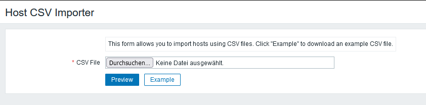

# IntelliTrend Zabbix CSV Host Importer

This is a Zabbix frontend module that provides a simplified host import via CSV files.



## License

This software is licensed under the GNU Lesser General Public License v3.0.

## Download

You can find the latest versions for the respective Zabbix releases on the [Github releases page](https://github.com/intellitrend/zabbix-csv-host-import-module/releases).

## Requirements

- Zabbix 6.0, 6.2, 6.4, 7.0, 7.2, 7.4
- File write access to the Zabbix frontend server
- Super admin permissions for the Zabbix users that want to use the frontend module

## Installation

For Debian and Ubuntu server, the Zabbix Frontend modules are usually placed in ``/usr/share/zabbix/modules/`` (up to Zabbix 7.0) or ``/usr/share/zabbix/ui/modules/`` (Zabbix 7.2 and newer).

Copy the folder `modules/csv-host-importer` to `/usr/share/zabbix/modules/csv-host-importer` or `/usr/share/zabbix/ui/modules/csv-host-importer` on the Zabbix frontend web server, depending on the Zabbix version.

**Note:** If you're using Zabbix 6.2 or 6.0, you'll need to remove `manifest.json` and rename `manifest.v1.json` to `manifest.json`.

Then go to `Administration`, `General`, `Modules`, click `Scan directory` and enable the new module in the list.

## Usage

Once the frontend module is activated, a new menu entry `Host CSV Importer` should appear under `Configuration` (6.0, 6.2) or `Data collection` (6.4+).

Here's an example of two hosts: the first one with Zabbix agent and another with an SNMPv2 agent:
```
NAME;VISIBLE_NAME;HOST_GROUPS;TEMPLATES;AGENT_IP;AGENT_DNS;SNMP_IP;SNMP_DNS;SNMP_VERSION;DESCRIPTION
example1;Example Host Agent;First host group, second host group;Linux by Zabbix agent;127.0.0.1;localhost;;;;Example Zabbix Agent host
example2;Example Host SNMP;Third host group;Generic by SNMP;;;127.0.0.1;localhost;2;Example SNMPv2 host
```

You can find more specific examples in the [examples directory](./examples/).

The following CSV columns are supported:

| Name                  | Purpose                                                      | Default           |
| --------------------- | ------------------------------------------------------------ | ----------------- |
| NAME                  | Host name. (required)                                        |                   |
| VISIBLE_NAME          | Host visible name.                                           |                   |
| HOST_GROUPS           | List of host group names, separated by a '\|'. Missing host groups are created automatically. (required) |                   |
| HOST_TAGS             | List of host tags, separated by a '\|'. The tag format can be either be ``tag name`` (empty value) or ``tag name=tag value``. |                   |
| HOST_MACROS           | List of host macros, separated by a '\|'. The macro format can be either be ``{$MACRONAME}`` (empty value) or ``{$MACRONAME}=macro value``. |                   |
| STATUS                | Host status (0 = monitored, 1 = disabled)                    | 0                 |
| PROXY                 | Name of the proxy that should monitor the host.              |                   |
| PROXY_GROUP           | Name of the proxy group assigned to the host. (Zabbix 7+)     |                   |
| TEMPLATES             | List of template names to assign to the host, separated by a '\|'. Templates must exist with the specified name. |                   |
| AGENT_IP              | Interface: Zabbix Agent IP address.                          |                   |
| AGENT_DNS             | Interface: Zabbix Agent DNS name.                            |                   |
| AGENT_PORT            | Interface: Zabbix Agent port.                                | 10050             |
| SNMP_IP               | Interface: SNMP IP address.                                  |                   |
| SNMP_DNS              | Interface: SNMP DNS name.                                    |                   |
| SNMP_PORT             | Interface: SNMP port.                                        | 161               |
| SNMP_VERSION          | Interface: SNMP version number (1, 2 or 3).                  |                   |
| SNMP_COMMUNITY        | Interface: SNMP community string.                            | {$SNMP_COMMUNITY} |
| SNMP_MAXREP           | Interface: SNMP max repitition count.                        | 10                |
| SNMP_V3SECNAME        | Interface: SNMPv3 security name.                             |                   |
| SNMP_V3SECLEVEL       | Interface: SNMPv3 security level.                            |                   |
| SNMP_V3AUTHPASSPHRASE | Interface: SNMPv3 auth passphrase.                           |                   |
| SNMP_V3PRIVPASSPHRASE | Interface: SNMPv3 priv passphrase.                           |                   |
| SNMP_V3AUTHPROTOCOL   | Interface: SNMPv3 auth protocol.                             |                   |
| SNMP_V3PRIVPROTOCOL   | Interface: SNMPv3 priv protocol.                             |                   |
| SNMP_V3CONTEXTNAME    | Interface: SNMPv3 context name.                              |                   |
| JMX_IP                | Interface: JMX IP address.                                   |                   |
| JMX_DNS               | Interface: JMX DNS name.                                     |                   |
| JMX_PORT              | Interface: JMX port.                                         | 12345             |
| DESCRIPTION           | Host description field.                                      |                   |
| INV_ALIAS             | Inventory: Alias                                             |                   |
| INV_ASSET_TAG         | Inventory: Asset tag                                         |                   |
| INV_CHASSIS           | Inventory: Chassis                                           |                   |
| INV_CONTACT           | Inventory: Contact person                                    |                   |
| INV_CONTRACT_NUMBER   | Inventory: Contract number                                   |                   |
| INV_DATE_HW_DECOMM    | Inventory: HW decommissioning date                           |                   |
| INV_DATE_HW_EXPIRY    | Inventory: HW maintenance expiry date                        |                   |
| INV_DATE_HW_INSTALL   | Inventory: HW installation date                              |                   |
| INV_DATE_HW_PURCHASE  | Inventory: HW purchase date                                  |                   |
| INV_DEPLOYMENT_STATUS | Inventory: Deployment status                                 |                   |
| INV_HARDWARE          | Inventory: Hardware                                          |                   |
| INV_HARDWARE_FULL     | Inventory: Detailed hardware                                 |                   |
| INV_HOST_NETMASK      | Inventory: Host subnet mask                                  |                   |
| INV_HOST_NETWORKS     | Inventory: Host networks                                     |                   |
| INV_HOST_ROUTER       | Inventory: Host router                                       |                   |
| INV_HW_ARCH           | Inventory: HW architecture                                   |                   |
| INV_INSTALLER_NAME    | Inventory: Installer name                                    |                   |
| INV_LOCATION          | Inventory: Location                                          |                   |
| INV_LOCATION_LAT      | Inventory: Location latitude                                 |                   |
| INV_LOCATION_LON      | Inventory: Location longitude                                |                   |
| INV_MACADDRESS_A      | Inventory: MAC address A                                     |                   |
| INV_MACADDRESS_B      | Inventory: MAC address B                                     |                   |
| INV_MODEL             | Inventory: Model                                             |                   |
| INV_NAME              | Inventory: Name                                              |                   |
| INV_NOTES             | Inventory: Notes                                             |                   |
| INV_OOB_IP            | Inventory: OOB IP address                                    |                   |
| INV_OOB_NETMASK       | Inventory: OOB host subnet mask                              |                   |
| INV_OOB_ROUTER        | Inventory: OOB router                                        |                   |
| INV_OS                | Inventory: OS name                                           |                   |
| INV_OS_FULL           | Inventory: Detailed OS name                                  |                   |
| INV_OS_SHORT          | Inventory: Short OS name                                     |                   |
| INV_POC_1_CELL        | Inventory: Primary POC mobile number                         |                   |
| INV_POC_1_EMAIL       | Inventory: Primary email                                     |                   |
| INV_POC_1_NAME        | Inventory: Primary POC name                                  |                   |
| INV_POC_1_NOTES       | Inventory: Primary POC notes                                 |                   |
| INV_POC_1_PHONE_A     | Inventory: Primary POC phone A                               |                   |
| INV_POC_1_PHONE_B     | Inventory: Primary POC phone B                               |                   |
| INV_POC_1_SCREEN      | Inventory: Primary POC screen name                           |                   |
| INV_POC_2_CELL        | Inventory: Secondary POC mobile number                       |                   |
| INV_POC_2_EMAIL       | Inventory: Secondary POC email                               |                   |
| INV_POC_2_NAME        | Inventory: Secondary POC name                                |                   |
| INV_POC_2_NOTES       | Inventory: Secondary POC notes                               |                   |
| INV_POC_2_PHONE_A     | Inventory: Secondary POC phone A                             |                   |
| INV_POC_2_PHONE_B     | Inventory: Secondary POC phone B                             |                   |
| INV_POC_2_SCREEN      | Inventory: Secondary POC screen name                         |                   |
| INV_SERIALNO_A        | Inventory: Serial number A                                   |                   |
| INV_SERIALNO_B        | Inventory: Serial number B                                   |                   |
| INV_SITE_ADDRESS_A    | Inventory: Site address A                                    |                   |
| INV_SITE_ADDRESS_B    | Inventory: Site address B                                    |                   |
| INV_SITE_ADDRESS_C    | Inventory: Site address C                                    |                   |
| INV_SITE_CITY         | Inventory: Site city                                         |                   |
| INV_SITE_COUNTRY      | Inventory: Site country                                      |                   |
| INV_SITE_NOTES        | Inventory: Site notes                                        |                   |
| INV_SITE_RACK         | Inventory: Site rack location                                |                   |
| INV_SITE_STATE        | Inventory: Site state                                        |                   |
| INV_SITE_ZIP          | Inventory: Site ZIP/postal code                              |                   |
| INV_SOFTWARE          | Inventory: Software                                          |                   |
| INV_SOFTWARE_APP_A    | Inventory: Software application A                            |                   |
| INV_SOFTWARE_APP_B    | Inventory: Software application B                            |                   |
| INV_SOFTWARE_APP_C    | Inventory: Software application C                            |                   |
| INV_SOFTWARE_APP_D    | Inventory: Software application D                            |                   |
| INV_SOFTWARE_APP_E    | Inventory: Software application E                            |                   |
| INV_SOFTWARE_FULL     | Inventory: Software details                                  |                   |
| INV_TAG               | Inventory: Tag                                               |                   |
| INV_TYPE              | Inventory: Type                                              |                   |
| INV_TYPE_FULL         | Inventory: Type details                                      |                   |
| INV_URL_A             | Inventory: URL A                                             |                   |
| INV_URL_B             | Inventory: URL B                                             |                   |
| INV_URL_C             | Inventory: URL C                                             |                   |
| INV_VENDOR            | Inventory: Vendor                                            |                   |

Additional hints:

* The columns are case-insensitive, so ``NAME``, ``name`` and ``NaMe`` are all valid.
* The columns must be in the first line of the CSV file.
* The separator character must be the same as in the import dialog and can either be a semicolon, comma or a tabulator.

The CSV file can then be imported in the same menu entry. You get a chance to preview the host list before the actual import.

